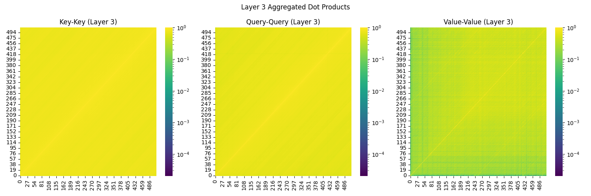
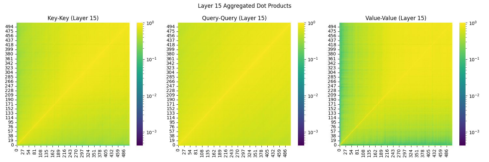

### Motivation: 

KV cache is important because it enables transformers to do inference in linear time instead of quadratic time. Re-computing the the keys and values of a token is very expensive because we have to run an attention that looks at all tokens before it. The problem with KV cache is that it takes up a lot of memory. GPUs not only have limited amount of high bandwidth memory, but also if our KV cache is too large, pulling the KV cache from HBM (high bandwidth memory) to SLM (shared local memory) and pushing the updates back can become a bottleneck. Indeed, transformers are often memory bottlenecked during token generation. Therefore, reducing the size of the KV cache enables speedy inference.  

As for why merged KV cache is important, I think there are two ways of looking at it. First it's practically useful. In addition to KV-cache quantization, it works along a difference axis to reduce the size of KV cache. When we quantize KV cache to 1-2 bits, I think we are already pushing the limits of how far we can go in this direction--we have reached information bottleneck. But working horizontally--merging kv cache is another way to further reduce memory. In fact I am aware that a lot of the SOTA quantization research has been shifting away from rounding-based quantization, towards bundling several dimensions of vectors in clever ways to reduce space. So, it's only reasonable that kv cache optimization would head towards this direction. 

Another more interesting and more personal reason is that I feel like studying how to chunk kv-cache is closely related to the larger problems of solving LLM memory / long context reasoning. LLMs operate in very fine-grained tokens (each word has multiple tokens). I think human brains operate in a much higher-level coarse grain space. So I think the key to solving long-horizon is just to have the model learn to chunk its tokens so it reason at a higher-level of abstraction. And the different research hand-designing how to chunk kv-cache feels a lot like before AlexNet was a thing and people were hand-designing ways to extract visual features. I think we will eventually reach a stage where chunking kv-cache is just something the model learns from training instead of an algorithm we need to hand design. 

Existing approaches include KNorm which chooses top-k lowest key norms and keep those states, H2O which also does pruning based on aggregate attention scores. SnapKV merges the keys and values based on weights determined from the attention score of some query. I think the ways prior approaches fall short are that a lot of them are based on empirical observations or vague intuition (e.g. KNorms paper observed that low key magnitude correlates with higher attn-aggregate score) and then design their kv cache merger/pruner around that observation. While that is valuable, I think this problem can be treated more mathematically because it has a very well defined objective. I think we can develop some mathematical understanding of why certain approximations are better and what the optimal strategy should look like, and that's what I will try to do in the next section. 

I'm going to use LongBench to evaluate content retrieval of the LLM and I will use Qwen2.5-Instruct for experiments. 

### Proposal / Method

**0. Looking at the keys, querys, and values**

Layer 3 key dot key, query dot query, and value dot value:

Layer 15 key dot key, query dot query, and value dot value:

What I observe is that in early layers, keys are very similar to each other across tokens. But in later layers it has a more locality structure. I also observed that locality structure only emerges when there's positional encoding. Values also have locality structure but it actually gets weaker for later layers. I am guessing this is probably because at high semantic levels (later in the layers), value of each token is supposed to contain a large chunk of text before that token, so that makes the difference the t^th token and (t+1)^th token not so meaningful.

**A. Some mathematical analysis**

I started looking at the problem from a very math-oriented angle: We want to minimize 
$$
E_{q} \left[||\sum_j v_j e^{k_j \cdot q} -  \sum_j v_j a_j n e^{k^* \cdot q} ||^2\right]
$$
where $a_j$ are the weighing coefficients of the merged value $v^* = \sum_j v_j a_j$ where $n$ is the number of tokens in the set. And $k^*$ is the merged key. We can expand the expression,

$$
\begin{align*}
L=&E_{q} \left[\sum_{ij} (v_i e^{k_i \cdot q} -  v_i a_i n e^{k^* \cdot q}) \cdot (v_j e^{k_j \cdot q} - v_j a_j n e^{k^* \cdot q}) \right]  \\
L=& E_{q} \left[\sum_{ij} (v_i \cdot v_j)  \left(e^{(k_i + k_j) \cdot q} - n a_j  e^{(k_i+k^*)\cdot q} -n a_i  e^{(k_j+k^*)\cdot q} + a_i a_j n^2 e^{2k^* \cdot q} \right) \right] \\
\frac{\partial L}{\partial a_m} =& \sum_{ij} (v_i \cdot v_j) E_q\left[ -n \delta_j^m e^{(k_i+k^*)\cdot q} -n \delta_i^m e^{(k_j+k^*)\cdot q} + (\delta_i^m a_j + \delta_j^m a_i) n^2 e^{2k^* \cdot q}\right] \\
=& \sum_i (v_i \cdot v_m) E_q\left[- 2n e^{(k_i+k^*)\cdot q} + 2a_i n^2 e^{2k^* \cdot q}\right]
\end{align*}
$$
One way to force this to be zero, is to force $\forall i$, 
$$
\begin{align*}
0=& E_q\left[- 2n e^{(k_i+k^*)\cdot q} + 2a_i n^2 e^{2k^* \cdot q}\right] \\
E_q\left[e^{(k_i+k^*)\cdot q}\right]=& a_i n E_q\left[e^{2k^* \cdot q}\right] \\
E_q\left[e^{2k^*\cdot q} e^{(k_i - k^*)\cdot q}\right]=& a_i n E_q\left[e^{2k^* \cdot q}\right] \\
a_i =& \frac{1}{n} E_q\left[e^{(k_i - k^*)\cdot q}\right]
\end{align*}
$$
Using the reasonable assumption that $k_j - k^*$ is orthogonal to $k^*$. We can approximate this value by the aggregate attention score for the subtraction of $k_j$ with a windowed mean $k_j - \text{mean}(k[j-w: j+w])$. Or alternatively, we can approximate it as $k_j - \max k[j-w: j+w]$ 

There is another condition: we also want to minimize
$$
E_{q} \left[||e^{k^* \cdot q} - \sum_j e^{k_j \cdot q}||^2\right]
$$
so that the normalization factor in attention doesn't change a lot (otherwise it would mess up attention to other tokens). We approximate the minimizer of this by requiring, 
$$
k^* \cdot E[q] = \log\left(\sum_i E[e^{k_i \cdot q}]\right) \approx \log(\max_i E[e^{k_i \cdot q}]) 
$$
So one way to approximate $k^*$ is the choose $k^* = \argmax E[e^{k_i\cdot q}]$ which justifies the choice of the pivot in MergeKV. 

So my main hypothesis is that using the aggregate attention scores to calculate the weights for $v^*$ using $a_i = \frac{1}{n} E_q\left[e^{(k_i - k^*)\cdot q}\right]$ would be better than using the gaussian kernel which I feel like doesn't have too much theory grounding. 

**B. Some thoughts for many to many mappings**

Obvious $a_i e^{k^* \cdot q}$ cannot be a good approximation of $e^{k_i \cdot q}$ for all $q$. It is just roughly a good approximation for the "average $q$". The problem, is if $q$ has a wide distribution, there would be $q'$ such that the approximation is bad. For example, consider $q'$ to be orthogonal to $E[q]$, then the approximation is quite bad. If we have many-to-many mapping, we can do a higher-order "low-rank" approximation of $e^{k_i \cdot q}$. 

To formalize things a bit, consider a metric $D(k_i, q) = e^{-k_i \cdot q}$. Then to approximate $D(k_i, q)$ what we are doing in many-to-one mapping is to approximate it as $D(k^*, q)$ multiplied by some fixed shift factor to form an unbiased estimate. This makes sense because we know $D(k^*, k_i)$. So if we know the distance from $q$ to $k^*$, then we know that the location of $k_i$ is limited to a ball around $k^*$ with radius $D(k^*, k_i)$. However, if we already have $k^*_1, k^*_2$ and we know both $D(k^*_1, k_i)$, and $D(k^*_2, k_i)$ than the region $k_i$ can lie on is reduced by one dimension. This is why I called it a "higher-order low-rank approximation". 

Perhaps a practical implementation of this would be: for $k_i$, merge it into the cluster represented by the pivot to its left, as well as the cluster represented by the pivot to its right. 

**C. Some observations from experiments**

The number is the compression coefficient. So 0.8 means the compressed kv cache is 0.8 of the size of the uncompressed. 

| Method          | Task                | Score  |
|-----------------|---------------------|--------|
| KNorm 0.6       | longbench_gov_report| 0.6038 |
| KNorm 0.8       | longbench_gov_report| 0.8491 |
| Top K Attn 0.5  | longbench_gov_report| 0.5472 |
| Top K Attn 0.6  | longbench_gov_report| 0.7358 |
| Top K Attn 0.8  | longbench_gov_report| 0.9057 |
| MergeKV 0.5     | longbench_gov_report| 0.7358 |
| MergeKV 0.8     | longbench_gov_report| 0.9245 |
| MeanKV 0.3      | longbench_gov_report| 0.6981 |
| MeanKV 0.5      | longbench_gov_report| 0.8302 |
| MeanKV 0.8      | longbench_gov_report| 0.6415 |
| CentroidKV 0.5  | longbench_gov_report| 0.6226 |
| CentroidKV 0.8  | longbench_gov_report| 0.5660 |

Experiment description:
1. KNorm: keep top k lowest key norms states + recent window
2. Top K Attn: keep top k highest aggregate attn states + recent window
3. MergeKV: as described in the paper
4. MeanKV: use the mean of keys as the pivot instead of the max, otherwise the same as MergeKV
5. CentroidKV: use the mean of keys as pivot, and compute value $v^*$ using aggregate attention scores $a_i = \frac{1}{n} E_q\left[e^{(k_i - k^*)\cdot q}\right]$, where we approximate $k_i - k^*$ with $k_i - \text{mean}(k[i-w: i+w])$. Also uses K-means (constrained to be continuous) as grouping mechanism. 

Notes and thoughts:
1. sometimes higher compression coefficient is bad because it affects the normalization coefficient in softmax, which I didn't study carefully in the math above. 
2. I'm disappointed by CentroidKV's performance. I don't think it entirely nullifies the hypothesis that using aggregate attention scores to calculate weighting for $v^*$ is better. The reason is because I sort of incorporated a bunch of other ideas in CentroidKV (because of the lack of time, I decided to just implement all those ideas together instead of adding them to MergeKV one by one). The new ideas in centroidkv include: a. k-means clustering instead of agglomerative clustering, b. using $k_i - \text{mean}(k[i-w: i+w])$ to approximate $k_i - k^*$, c. using the mean of keys as pivot, and d. using aggregate attention score to compute weighting for $v^*$. If I had more time, I would isolate these into separate experiments. I think removing the k-means clustering approach, and changing the pivot from the mean back to the max and then using $k_i - \max(k[i-w: i+w])$ to approximate $k_i -k^*$ would be good things to try next. The reason I decided to do k-means and also use the mean of keys as the pivot was because of an mistake in the calculation I made that led me to believe it was better. 

**D. Code structure**

eval.py runs lm_eval on long-bench. I filtered out longer length samples from the benchmark because I used a single A100 and it runs out of memory on longer samples. 

src/attn_patch.py allows me to customize how kv-cache is used in the forward function of the qwen attention module. This is necessary because mergekv and centroid kv need access to the attn_weights which the cache normally doesn't have. 

src/hf_cache.py contains multiple cache implementations, KNormCache, TopKKV (corresponds to Top K Attn in experiment), MergeKV, CentroidKV, HybridKV (using the agglomerative clustering + max aggregate attn key as pivot + using my method of calculating value weighting). 

### AI Assistant use:

I like to keep the fun part of writing code and doing math to myself, so I don't use coding assistants much. But I use chatbots a lot for helping to debug environmental setup issues, and to parse stack tracebacks. I also had it write the explore/heatmap.py file for printing out correlations between keys and values. I use chatbot to help me read papers. For any paper I read, I asked chatgpt to summarize its content first, and then I just read the methodology section if I need to know the details. 